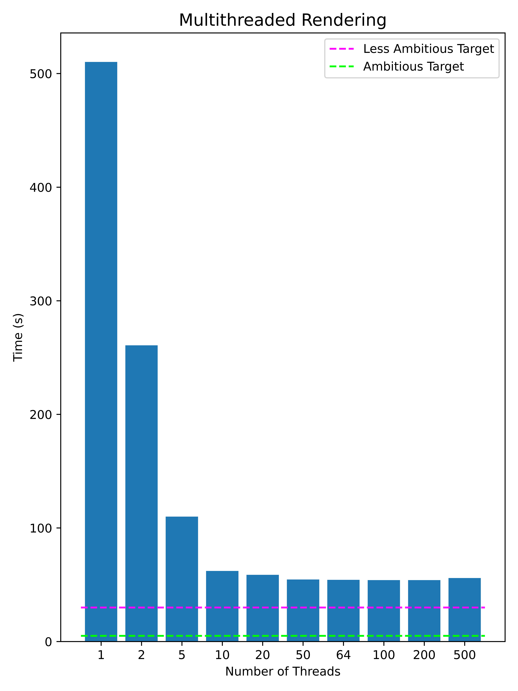
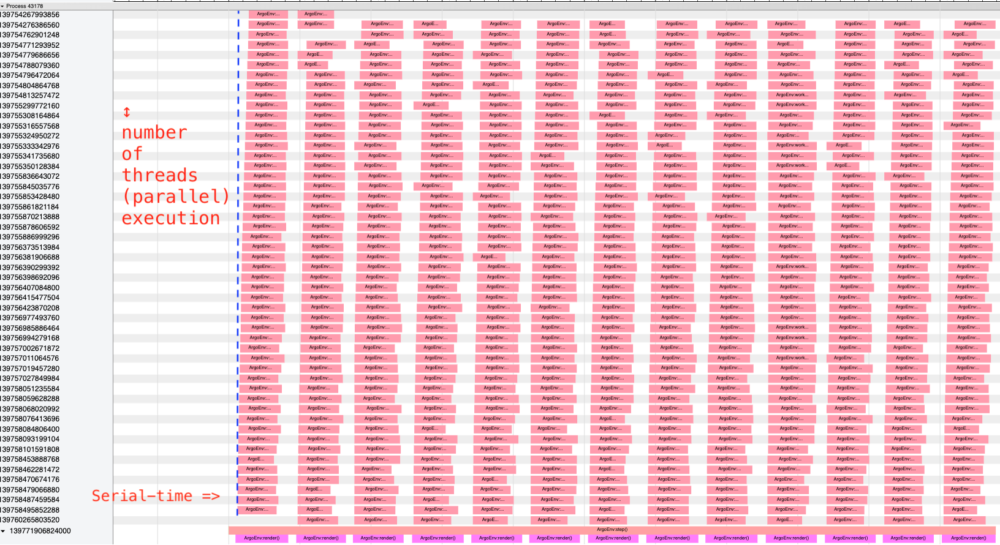
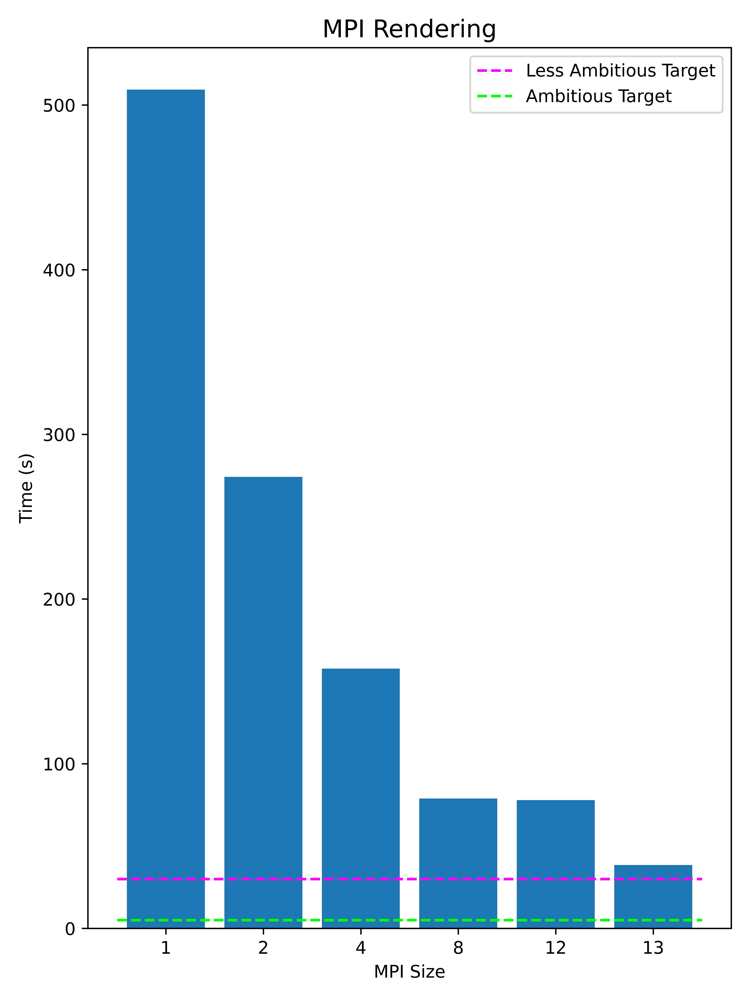
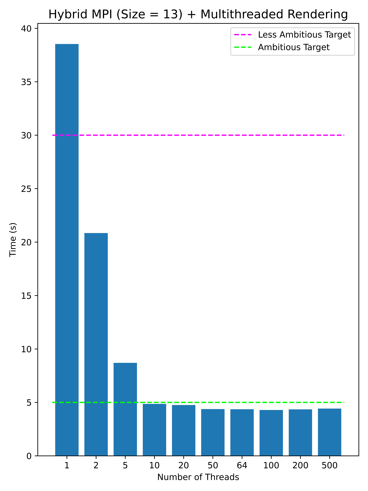

# 🌱 Parallel Rendering for In Situ Incident Light Calculation 🌱

We are interested in optimizing the study of computational agroceology by simulating ecosystem and individual plants using Mitsuba2, a physics engine that renders the environment and simulates incident light. 

## Overview

1. [Introduction](#introduction)
3. [Test Scenario](#test-scenario)
2. [Methods](#methods)
6. [Results](#results)
8. [Future Work](#future-work)
7. [Acknowledgement](#acknowledgment)
8. [Resources and Platform](#resources-and-platform)

## Introduction

We are working on creating an Environment for a Reinforcement Learning agent capable of optimizing plant sowing strategies using rewards and penalties obtained from incident light values on plant objects. 

In order to render a scene and calculate incident light, we are using Mitsuba 2, a research-oriented rendering system. Using Mitsuba, rendering a scene and calculating the incident light on one plant object takes approximately 1 second on a 6 core i7 CPU. Typically, training of an RL model comprises of episodes in the orders of hundred or thousands, which are in turn contain several hundred or thousand steps. In the current set up, each training episode, that represents 1 year, comprises of 365 steps, with each step representing 1 day. Each step itself comprises of 12-13 render cycles, where each render cycle represents 1 daylight hour. Even if we take 1 second per plant, in the case of 500 plants, we will end up taking 500 seconds per render cycle. In order for one training cycle comprising of 1000 episodes and 365 steps per episode, our training time would be 500 x 13 x 365 x 1000 = 2.372x10^9 seconds or ~75 years of computation time, thus rendering our experiment inefficient and impossible. 

Therefore, our goal is to optimize the rendering of incident light for multiple plant objects in the Mitsuba environment using parallel computing techniques as discussed in CSCI 596.

## Test Scenario

<b>Fig.1 - 360 degree view of a field with 500 plant objects</b>
 
 

In order for us to efficiently compare an improvement in the computation time, we have created a test case with 500 plant objects at specific x and y locations. This test case is used for methods discussed below, and the time taken for each method is the time taken to render the scene and calculate the incident light on each plant for 13 render cycles, i.e. 1 step.

<b>Fig.2 - Baseline Results</b>
 
 

Fig. 2 shows the time taken for <b>1 step</b> on a local machine (Macbook Pro 2019) and on the EPYC-64 node on the Disovery cluster at CARC USC. These results will serve as our baseline as we implement different parallel rendering techniques.

## Methods

Our main script is _episode\_timing.py_ which loads are test scenario and then creates an object of the appropriate class (_gym\_mitsuba\_env_) and records the time taken for the execution of 1 step for that particular implementation.

### Python Parallelization: 

* __Multithreading__

	Multithreading was implementing using Python's native _concurrent.futures_ library. Multithreading is implemented in the _render()_ and _worker\_func()_ methods within the _gym\_mitsuba\_env\_multithread.py_ script. Each thread was responsible for calculating incident light on a particular set of plants. As the number of threads increased, the size of this set decreased per threads decreased in comformance with Amdalh's law where total workload is fixed and it is divided among **N** number of threads, where **N** increases.

	+ Interactive Slurm Job command: __salloc --nodes=1 --ntasks=64 --cpus-per-task=1 --mem=0 --time=1:00:00 --partition=epyc-64 --account=***__

* __Multiprocessing__
 
	Multiprocessing was achieved by using the Message Passing Interface (MPI) library designed for Python _MPI4Py_. Multiprocessing was implemented in _episode\_timing.py_ and the _step()_ function of _gym\_mitsuba\_env\_mpi4py.py_ script. Each rank in this implementation was responsible for a set of render cycles, as the MPI size increased, the set of render cycles each rank was responsible for decreased.
	
	Our multithreaded implementation carried over to this implementation as well. However, initially the number of threads to be used was set to 1.
	
	In case of hybrid MPI + Multithreading function, we simply changed the number of threads - i.e. _max\_workers_ in _render()_ to the desired number. Each rank was responsible for a set of render cycles, and each thread was responsible for a set of plant objects. 

	+ Interactive Slurm Job command: __salloc --nodes=13 --ntasks=13 --cpus-per-task=64 --mem=0 --time=1:00:00 --partition=epyc-64 --account=***__

### C++ Parallelization: 

* __Multithreading__

	The Mitsuba 2 library is implemented in C++ and has built-in multithreading. We did not have to optimize this, since whenever the renderer was called, it would utilize all the number of threads at its disposal.

## Results

All of the timing results can be found in _Speedup\_Test/Timing\_Data.txt_.

### Multi-threading Parallel Mitsuba Rendering

<b>Fig.3 - Multithreaded Implementation Timing Results</b>
 
 

As we increase the number of threads, we see a sharp improvement in the time taken to complete 1 step. From 510 seconds for 1 thread, to 54 seconds for > 50 threads, we see an approximately 10x speedup. 

We can also see that after 10 threads (62.164 seconds) we get diminishing returns in terms of speed improvement.

#### Profiling

<b>Fig.4 - Profiling Results on Multithreaded Implementation</b>
 
 

In the visual table above, we have serial-time on the horizontal axis and the parallel execution on the vertical-axis. The functions being executed in parallel are work_func() instances and each such function represents a single thread exectuing in parallel. The serial functions are render() and step(). The render() function is executed for each hour of the day. Both function render() and step() are executing in serial time and can be seen on the 	    horizontal axis. Some observations regarding the multiple threads execution:	

* All the threads do not start at the same time, in the render() function, we can see a tilt as shown with reference to a blue line, as can be show in the time graph. This is because of the latency of starting a new thread. In this image, there are 50 threads that work in parallel to perform the calculations. 

### MPI Paralllel Mitsuba Rendering
<!-- add Interactive Job Command -->

<b>Fig.5 - MPI Implementation Timing Results</b>
 
 
After seeing an improvement through multithreaded, we implemented multiprocessing using MPI. Here the results are promising as well. From 510 seconds with MPI Size 1 to 38.530 seconds with MPI Size 13, we see a 13x speedup.

We see a near 2x speed up when we go from MPI Size 12 to Size 13, since in there are 13 render cycles and in the case with MPI Size 12, one rank of the 12 will have to do double the computation in a serial manner.

### Hybrid MPI + Multi-threading Parallel Mitsuba Rendering
<!-- add Interactive Job Command -->

<b>Fig.6 - Hybrid MPI + Multithreaded Implementation Timing Results</b>
 
 
Encouraged by both the multithreading and MPI implementations, we then combined both approaches to see if we could achieve further speedup, and in doing so achieve the targets we had set out with. Using an MPI of Size 13 and multithreading with > 10 threads, we were successfully able to achieve even our most ambition target. We observe here again that we get diminishing returns after 10 threads.
 
 

Our best performing case is MPI of Size 13 with 100 threads, with an execution time of 4.288 seconds, achieving a speedup of __120x__ compared to the initial run on Discovery, and a speedup of __274x__ compared to the time taken on our local machine.

<!-- ## Work Distribution

**Oneeb:** Create test case, organize code and work on parallelism in python code.

**Iris:** Generate results and visualizations in plots. Working on parallelism using MPI4py and multi-threading and processes in python. 

**Armaghan:** Profiling Python and C++ Code. Multithreading for Mitsuba. -->

## Future Work

We were unsuccessful in being able to run Mitsuba on a GPU, due to build errors. We expect considerable improvement in execution time, if we successfully deploy it on a GPU device, so moving forward that will be the focus. Additionally, there is some debugging to be done before we can port this code over to our RL environment.

## Acknowledgment

Our team is very grateful to **Tomek Osinski** from CARC who was of great help in setting up the Mitsuba library for us on Discovery, a process which turned out to be rather convoluted and complicated.

## Resources and Platform

* C++
* Python
* Python Libraries
	* [MPI4Py](https://mpi4py.readthedocs.io/en/stable/mpi4py.html)
	* [concurrent.futures](https://docs.python.org/3/library/concurrent.futures.html)
* [Mitsuba2](https://mitsuba2.readthedocs.io/en/latest/generated/plugins.html#bsdfs)
* [CARC Discovery](https://www.carc.usc.edu/user-information/user-guides/hpc-basics/slurm-templates)

<!-- ## Tasks

- [x] Port to Discovery Cluster 
- [x] Create test case (field with 500 plants)
	- [x] Correct GIF w/ white background
- [x] Run test case on Discovery-EPYC and Local m/c 
- [x] Identify how to visualize information 
- [x] Profiler for Python 
- [ ] Profile for C++ (Mitsuba) 
- [x] Analyze Profiling Results 
- [x] Implement Parallel Programming Techniques 
	- [x] Implement Multithreading
		- [ ] Determine reason for segmentation faults
	- [x] Implement MPI  
		- [x] Determine why rank 6 takes longer
		- [ ] Aggregate values back in rank 0
		- [ ] Determine xml error reason
		- [ ] Be able to run multiple times -->
