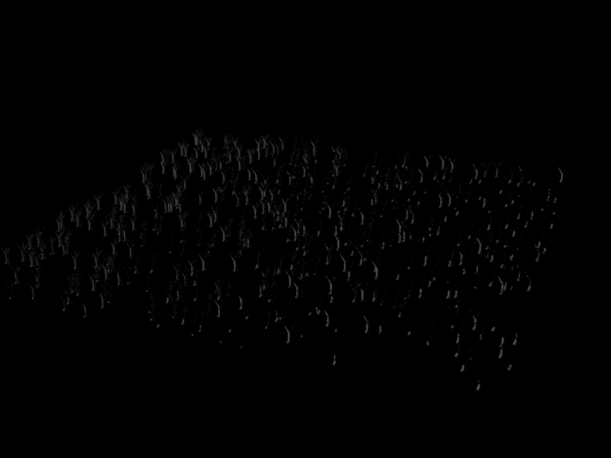
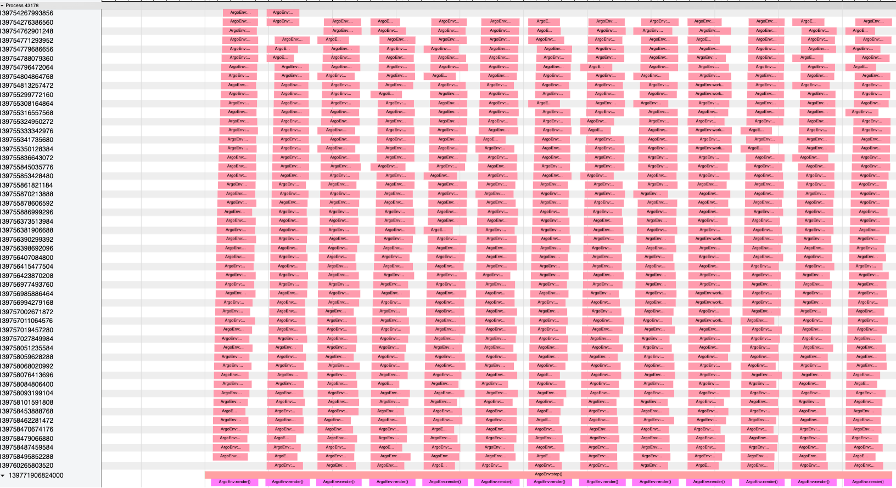

# 🌱 Parallel Rendering for In Situ Incident Light Calculation 🌱

We are interested in optimizing the study of computational agroceology by simulating ecosystem and individual plant using Mitsuba, a physics engine that renders the environment and simulates incident light. 

## Overview

1. [Introduction](#introduction)
3. [Resources and Platform](#resources-and-platform)
2. [Task](#tasks)
4. [Methods](#methods)
5. [Preliminary Results](#prelimary-results)
6. [Work Distribution](#work-distribution)
7. [Acknowledgement](#acknowledgment)

## Introduction

We model the growth of plant objects in simulation as a decision-making process and construct the rewards and penalties based of the incident light on plant objects. Our end goal will be to train a plant sowing agent using reinforcement learning (RL) algorithms. 

Rendering and calculation of incident light on one plant object takes approximately 1 second on a 6 cores i7 CPU. As the RL agent sows more plants in the environment, each individual rendering could end up taking 2 or 3 orders of magnitude longer. 

In the current set up, each training episode, that represents 1 year, comprises of 365 steps, with each step representing 1 day. Currently, the render time for 1 episode is > 15 hours. It is very computationally expensive to simulate 1-year for plants in the envivronment to effectively understand the growth of plants. 

Therefore, we aim to optimize the rendering of incident light for multiple plant objects in mitsuba environment using parallel computing techniques running on CPUs and GPUs.

## Resources and Platform

* Python
	* MPI4Py
* C++
* Mitsuba2
* CARC Discovery 

## Tasks

- [x] Port to Discovery Cluster 
- [x] Create test case (field with 500 plants)
	- [ ] Correct GIF w/ white background
- [x] Run test case on Discovery-EPYC and Local m/c 
- [x] Identify how to visualize information 
- [x] Profiler for Python 
- [ ] Profile for C++ (Mitsuba) 
- [X] Analyze Profiling Results 
- [ ] Implement Parallel Programming Techniques 

## Methods

### Python Parallelization: 

* __Spatial Decomposition__
* __Multithreading__
* __Multiprocessing__

### C++ Parallelization: 

* __Multithreading__

## Preliminary Results

	
	

 
 
 
 
 
 
 
 
 
 
 
 
 
 
 
 
 

## Parallelization Results

	

 
	In the visual table above, we have serial-time on the horizontal axis and the parallel execution on the vertical-axis. The functions being executed in 		parallel are work_func() and each such function represents a thread exectuing in parallel. The serial functions are render() and step(). The render() 		function is executed for each hour of the day.

 
 
 
 
 
 
 
 
 
 
 
 
 
 
 
 
 

## Work Distribution

**Oneeb:** Create test case, organize code and work on parallelism in python code.

**Iris:** Generate results and visualizations in plots. Working on parallelism using MPI4py and multi-threading and processes in python. 

**Armaghan:** Profiling Python and C++ Code. Multithreading for Mitsuba.

## Acknowledgment

Our team is very grateful to **Tomek Osinski** from CARC who was of great help in setting up the Mitsuba library for us on Discovery, a process which turned out to be rather convoluted and complicated.

