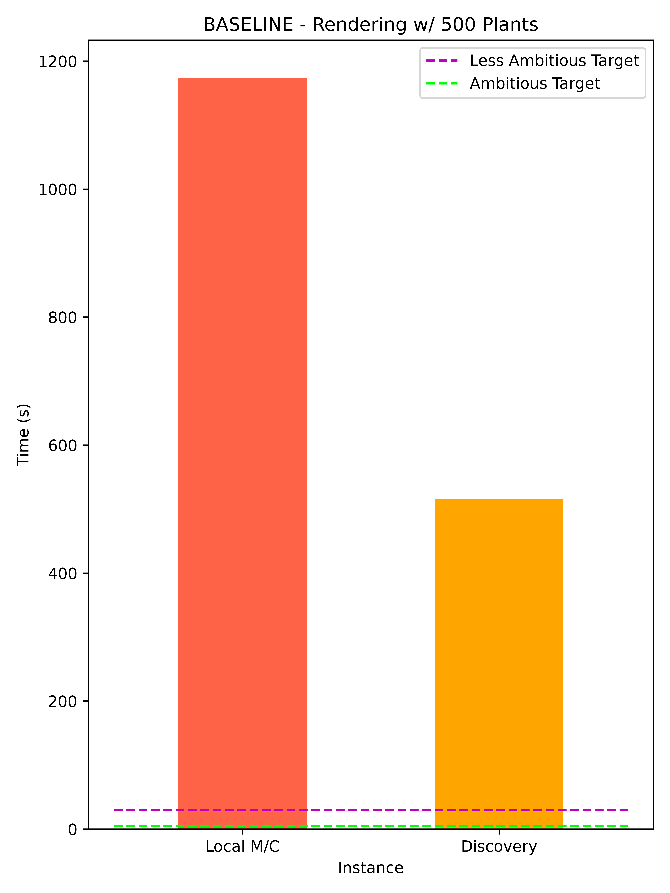

# 🌱 Parallel Rendering for In Situ Incident Light Calculation 🌱

We are interested in optimizing the study of computational agroceology by simulating ecosystem and individual plants using Mitsuba2, a physics engine that renders the environment and simulates incident light. 

## Overview

1. [Introduction](#introduction)
3. [Test Scenario](#test-scenario)
2. [Methods](#methods)
6. [Results](#results)
7. [Acknowledgement](#acknowledgment)
8. [Future Work](#future-work)
8. [Resources and Platform](#resources-and-platform)

## Introduction

We are working on creating an Environment for a Reinforcement Learning agent capable of optimizing plant sowing strategies using rewards and penalties obtained from incident light values on plant objects. 

In order to render a scene and calculate incident light, we are using Mitsuba 2, a research-oriented rendering system. Using Mitsuba, rendering a scene and calculating the incident light on one plant object takes approximately 1 second on a 6 core i7 CPU. Typically, training of an RL model comprises of episodes in the orders of hundred or thousands, which are in turn contain several hundred or thousand steps. In the current set up, each training episode, that represents 1 year, comprises of 365 steps, with each step representing 1 day. Each step itself comprises of 12-13 render cycles, where each render cycle represents 1 daylight hour. Even if we take 1 second per plant, in the case of 500 plants, we will end up taking 500 seconds per render cycle. In order for one training cycle comprising of 1000 episodes and 365 steps per episode, our training time would be 500 x 13 x 365 x 1000 = 2.372x10^9 seconds, thus rendering our experiment impossible. 

Therefore, our goal is to optimize the rendering of incident light for multiple plant objects in the Mitsuba environment using parallel computing techniques as discussed in CSCI 596.

## Test Scenario
<figure>

<figcaption aligh='center'>360 degree view of a field with 500 plant objects</figcaption>
</figure>

 360 degree view of a field with 500 plant objects 

## Methods

### Python Parallelization: 

* __Multithreading__
* __Multiprocessing__

### C++ Parallelization: 

* __Multithreading__

## Results

### Multi-threading Paralllel Mitsuba Rendering
<!-- add Interactive Job Command -->

#### Profiling

	

In the visual table above, we have serial-time on the horizontal axis and the parallel execution on the vertical-axis. The functions being executed in parallel are work_func() instances and each such function represents a single thread exectuing in parallel. The serial functions are render() and step(). The render() function is executed for each hour of the day. Both function render() and step() are executing in serial time and can be seen on the 	    horizontal axis. Some observations regarding the multiple threads execution:	

> All the threads do not start at the same time, in the render() function, we can see a tilt as shown with reference to a blue line, as can be show in the time graph. This is because of the latency of starting a new thread. In this image, there are 50 threads that work in parallel to perform the calculations. 

### MPI Paralllel Mitsuba Rendering
<!-- add Interactive Job Command -->

### Hybrid MPI + Multi-threading Parallel Mitsuba Rendering
<!-- add Interactive Job Command -->

<!-- ## Work Distribution

**Oneeb:** Create test case, organize code and work on parallelism in python code.

**Iris:** Generate results and visualizations in plots. Working on parallelism using MPI4py and multi-threading and processes in python. 

**Armaghan:** Profiling Python and C++ Code. Multithreading for Mitsuba. -->

## Future Work

- [x] Implement Parallel Programming Techniques 
	- [x] Implement Multithreading
		- [ ] Determine reason for segmentation faults
	- [x] Implement MPI  
		- [x] Determine why rank 6 takes longer
		- [ ] Aggregate values back in rank 0
		- [ ] Determine xml error reason
		- [ ] Be able to run multiple times

## Acknowledgment

Our team is very grateful to **Tomek Osinski** from CARC who was of great help in setting up the Mitsuba library for us on Discovery, a process which turned out to be rather convoluted and complicated.

## Resources and Platform

* C++
* Python
* Python Libraries
	* [MPI4Py](https://mpi4py.readthedocs.io/en/stable/mpi4py.html)
	* [concurrent.futures](https://docs.python.org/3/library/concurrent.futures.html)
* [Mitsuba2](https://mitsuba2.readthedocs.io/en/latest/generated/plugins.html#bsdfs)
* [CARC Discovery](https://www.carc.usc.edu/user-information/user-guides/hpc-basics/slurm-templates)

<!-- ## Tasks

- [x] Port to Discovery Cluster 
- [x] Create test case (field with 500 plants)
	- [x] Correct GIF w/ white background
- [x] Run test case on Discovery-EPYC and Local m/c 
- [x] Identify how to visualize information 
- [x] Profiler for Python 
- [ ] Profile for C++ (Mitsuba) 
- [x] Analyze Profiling Results 
- [x] Implement Parallel Programming Techniques 
	- [x] Implement Multithreading
		- [ ] Determine reason for segmentation faults
	- [x] Implement MPI  
		- [x] Determine why rank 6 takes longer
		- [ ] Aggregate values back in rank 0
		- [ ] Determine xml error reason
		- [ ] Be able to run multiple times -->